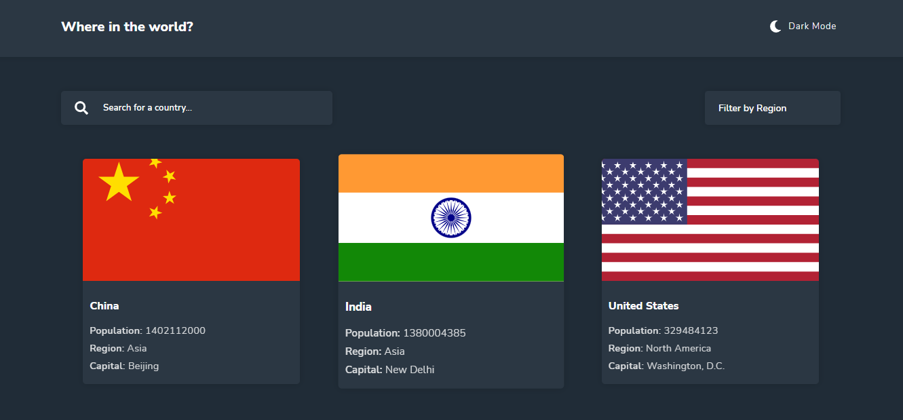

# Portfolio Project - REST Countries API with color theme switcher

# Project Objective

To integrate with the REST Countries V3.1 API to pull country data and display it as shown below.
The team is required to use the React javascript front end framework with complete control of which packages it uses to do things.e.g: make HTTP request or style the project.

### Customer Requirements

Users should be able to:

- View the optimal layout for the site depending on their device's screen size
- See all countries from the API on the homepage
- Search for a country using an `input` field
- Filter countries by region
- Click on a country to see more detailed information on a separate page
- Click through to the border countries on the detail page
- Toggle the color scheme between light and dark mode

### Links

- Solution URL: [https://github.com/AbdulRazak2/Rest_Countries_Api.git](https://github.com/AbdulRazak2/Rest_Countries_Api.git)
- Live Site URL: [https://www.netlify.com/](https://hungry-hypatia-92a39d.netlify.app)

### Screenshot

## Our process

A team of four front-end developers used React functional components to build the project.
Each team member worked on the particular user story assigned to them. Finally the project was deployed via Netlify.

### Built with

- [React](https://reactjs.org/) - JS library
- [Styled Components](https://styled-components.com/) - For styles
- [React Router](https://reactrouter.com/) - For user interfaces
- [Downshift](https://www.downshift-js.com/) - For select input

## Author

- GitHub - [AbdulRazak2](https://github.com/AbdulRazak2)

## Collaborators

- GitHub - [eashong2021](https://github.com/eashong2021)
- GitHub - [blankwriter](https://github.com/blankwriter)
- GitHub - [Ramsonodoi](https://github.com/Ramsonodoi)
